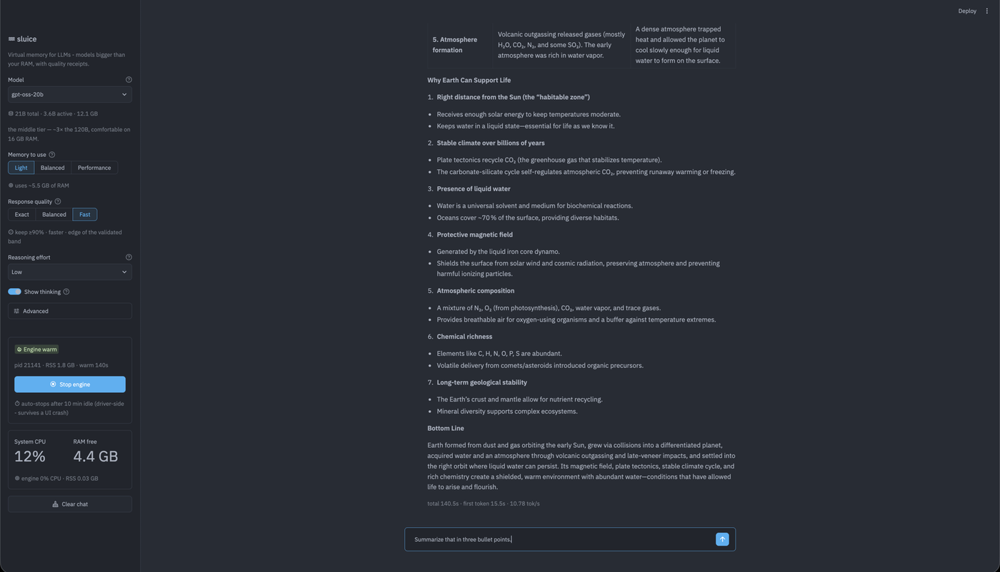
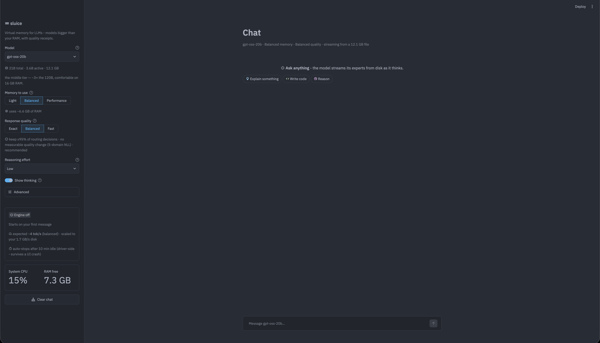

<div align="center">

```
                     ╭──────────────────────────────╮
     ≋≋≋≋≋≋≋≋≋≋≋≋≋≋≋≋┤   21B params · 12.1 GB       │
     ≋≋≋≋≋≋≋≋≋≋≋≋≋≋≋≋┤   sitting on your SSD        │
     ≋≋≋≋≋≋≋≋≋≋≋≋≋≋≋≋┤                              │
                     ╰───────────────┬──────────────╯
                                 ╔═══╧═══╗
                                 ║ ▓▓▓▓▓ ║   the gate — 6.6 GB of RAM
                                 ╚═══╤═══╝
                                     ▼
                            6.14 tok/s · bit-exact
```

# ≋ sluice

**Models bigger than your RAM, with quality receipts.**

*Big models through a small gate.*

</div>

---

**Virtual memory for LLMs.** Run Mixture-of-Experts models **bigger than your RAM** by streaming their experts from SSD on demand — **bit-exact by default**, on **any GGUF MoE** via architecture-family adapters, not one hard-coded model.

> **The honest promise we defend:** run any MoE model on arbitrarily small RAM/compute with **bit-exact quality**, where **speed is a smooth, predictable function of the resources you give it — measured up front, never a bait-and-switch.**
>
> **What "bit-exact" means precisely:** **bit-exact is a config-pinned guarantee** (same settings → same bits, gate-enforced); across batch shapes the upstream backend itself varies in deep decimals (measured across RC3, RC4 and pristine b10064). **Argmax is usually but NOT always stable across shapes**: S1 found a counterexample — the same 198-token prompt produced `"every"` vs `"Every"` at generated token 73 depending only on whether the prefix was reused or prefilled cold. So identical *settings* give identical bits; different *batch shapes* can, rarely, change a word. So the guarantee is *reproducibility at a pinned configuration*, not bit-identity across every batch shape — and the distinction is measured, not asserted.

A frontier MoE touches only a sliver of itself per token — **DeepSeek-V4, Kimi K2.7 / K3, GLM-class 700B+** checkpoints all route just a few percent of their experts per token (the model our numbers below come from, gpt-oss-20b, activates 3.6 B of 21 B). So the model doesn't need to *fit* in RAM — it needs to be *placed*: the dense trunk (attention, embeddings, router, shared experts) stays resident at int4, the routed experts live on disk and stream through an expert-aware cache. Everything the engine does is an attack on one formula:

```
tok/s  ≤  storage_bandwidth / ((1 − cache_hit_rate) × routed_bytes_per_token)
```

Ollama solved *running a model that fits your machine*. sluice solves *the model that doesn't*.

<!-- Screenshot: drop a UI capture at docs/media/ui.png, then uncomment the line below. -->
<!--  -->

---

## Headline numbers

Every number below was measured on the same **$1,000 MacBook Air M2, 16 GB** and traces to an on-disk artifact. **No projections, no "up to."**

| # | Config / load | Measured | Source |
|---|---|---|---|
| 1 | **Exact**, streamed, quiet box, N=64 | **6.14 tok/s** · hit .861 · footprint 6.73 GB | E37c · [`results/e37c/`](results/e37c/) |
| 2 | **Exact**, light desktop load (8.4 GB free) | **4.89 tok/s** | E37d · [`results/e37d/`](results/e37d/) |
| 3 | **Exact**, heavy load (1.5 GB free) | **1.57 tok/s** | E37 · [`results/g1_e37/`](results/g1_e37/) *(contaminated; kept as the under-load point)* |
| 4 | **Fast**, warm sustained chat | **8.79 tok/s** | field observation, [lablog](docs/lablog.md) 2026-07-21 |
| 5 | **Fast + Light** memory, live UI, cold turn | **10.78 tok/s** · hit .918 · 4.4 GB free | live session, [screenshot above](#see-it-running) |
| 6 | **First token**, cold vs warm (canon on) | **15.5 s → 3.1 s** · reuse 1068 → 1204 | live session, 3 turns |
| 7 | **First token**, harness, matched rendering | **3.0 s** vs 8.2 s without canon, 16.2 s cold | E41b run 2 · [`results/e41b/`](results/e41b/) |

**Rows 1–3 are the same settings and the same bit-exact output** (`7fff2b7b9461da2a` in
every one) — only machine load changes. Rows 4–6 are **Fast** quality: a labelled,
measured trade, not the same thing as row 1. Rows 5–6 come from **uncontrolled live
sessions**, not pre-registered runs, and are marked as such.

**One machine, honestly.** Every row above is a **MacBook Air M2, 16 GB, CPU backend**.
We are not going to imply a fleet we do not have. The table is built to grow —
see [CONTRIBUTING.md](CONTRIBUTING.md) for how to add a row with receipts.

Read the fine print — it's the point:
- **6.14 tok/s is the bit-exact rung** — identical logits to the fully-resident model.
  **8.79 / 10.78 are Fast** — a labelled quality trade (see the dial).
- **First-token latency was our worst number** (21.7 s cold). Multi-turn is now
  **~3 s** because the KV is canonicalized after each reply; the cold first turn is
  still prefill-bound and still the honest weak spot.
- `time -l` peak RSS reads 10.04 GB and includes reclaimable mmap pages that grow with
  generation length. **phys_footprint (6.73 GB) is the memory that actually costs RAM.**
  We report both and quote the one that reflects real pressure.

The full experiment record — every prediction written *before* the result, every artifact path — is [`docs/lablog.md`](docs/lablog.md).

---

## Quickstart

Needs macOS on Apple Silicon (the only tested platform), Python 3, cmake, and a C++ toolchain. ~12 GB free disk for the default model.

```bash
git clone https://github.com/UmarFarooq75/sluice.git
cd sluice
bash scripts/install.sh                # one-time: fetches llama.cpp, applies our fork
                                       # patch, builds the engine, creates the venv.
                                       # Downloads NO model.

# See what THIS machine will actually do — before downloading anything.
./cli/sluice estimate gpt-oss-20b      # probes your disk bandwidth, prints honest tok/s per mode

./cli/sluice pull gpt-oss-20b          # ~12 GB, only once you've seen the estimate
./cli/sluice ui                        # playground → http://localhost:8501
```

`scripts/install.sh` is **required on a fresh clone**: `vendor/` is deliberately not committed, so there is no llama.cpp to link against until the installer fetches the pinned revision (`b10064`) and applies [patches/llmstream.patch](patches/llmstream.patch). It is safe to re-run — each step is skipped if already satisfied. **Only macOS/Apple Silicon is tested**: the driver links `-lobjc -framework Foundation` for the thermal probe, so Linux needs edits, and the installer says so up front instead of failing mysteriously.

Prefer the terminal, or an API?

```bash
./cli/sluice run   gpt-oss-20b         # chat REPL on a persistent warm server
./cli/sluice serve gpt-oss-20b         # OpenAI-compatible HTTP API (/v1/chat/completions)
./cli/sluice list                      # models on disk (and what a pull would cost)
```

The engine is a llama.cpp fork; the first CLI call builds it automatically (`bash scripts/build_driver.sh`), so there's no separate build step to remember.

---

## See it running



**Before you send anything.** `gpt-oss-20b` · **Balanced** memory (~6.6 GB) · **Balanced**
quality · Reasoning Low · engine off. The card says **`expected ~4 tok/s (balanced) ·
scaled to your 1.7 GB/s disk`** — that estimate is produced by probing *this* machine's
disk before the model loads, which is the whole point: you see the price before you pay
it. Machine at that moment: 15% CPU, 7.3 GB RAM free.


**A completed answer.** Same model · **Light** memory (~5.5 GB) · **Fast** quality ·
Reasoning Low · engine warm (pid 21141, RSS 1.8 GB). Caption underneath reads
**`total 140.5s · first token 15.5s · 10.78 tok/s`** — a cold first turn with no reuse.
Machine: 12% CPU, **4.4 GB RAM free** — a 21B model answering with less free RAM than the
model file is large.

> Both screenshots are single real sessions on the reference machine, cropped only to
> remove browser chrome. The configuration in each caption is the one visible in the
> image, not one recalled afterwards.


---

## The quality dial

Speed and fidelity trade on a single, **family-agnostic** knob (`LLMSTREAM_AGREE_TARGET` — the fraction of the router's true top-k experts the engine must keep). The UI exposes it as three modes:

| Mode | Keeps | What it means | Bit-exact? |
|---|---|---|---|
| **Exact** *(default)* | 100% of true top-k | Identical logits to the fully-resident model; hash-gated every commit | **Yes** |
| **Balanced** | ≥ 95% | No measurable quality change on our 5-domain NLL suite; recommended | No |
| **Fast** | ≥ 90% | Faster; the edge of the validated band | No |

Exact is the default because our contract is *correctness first*. Balanced and Fast let the engine keep an already-cached expert instead of stalling for the true one when the router's margin is tiny — a labeled, measured trade, never a silent one.

**You see the price before you pay it.** `sluice estimate` (and the UI's pre-load card) probe your actual disk bandwidth and print the expected tok/s for each mode **before** the model loads — the estimator has matched live runs within noise.

---

## Honest limits

This section is the differentiator. We'd rather you know the edges than trip over them.

- **Dense (non-MoE) models: batch / fleet only.** Streaming works *because* MoE touches a sliver per token. A dense model touches 100% of its weights every token — single-stream streaming is a physics no-go (disk-bound, no cache to help). Dense support is meaningful only for offline/throughput batch, never interactive single-user. (`docs/dense-strategy.md`.)
- **Huge-model demos are *capability*, not *speed*.** "Run a 671 B model from a 40 GB disk footprint" is real and it runs — at roughly **~0.1 tok/s** (anchored to colibri's measured GLM-5.2 on 25 GB RAM). That's overnight/agentic/batch use. The value is "runs where nothing else can," never "runs fast." We refuse to frame it as a speed number.
- **MTP is lost through GGUF — a format ceiling, not a TODO.** Native multi-token-prediction heads (colibri credits theirs with 2.2–2.8× throughput) are **dropped when a model is converted to GGUF**. No GGUF-served engine can run them. Crossing that ceiling would mean abandoning GGUF universality — a different product, not a patch.
- **First-token latency is our worst UX number today.** Cold prefill of a long prompt takes tens of seconds (21.7 s above; more as a conversation grows and re-prefills). Decode is competitive; TTFT is the open problem we don't hide.

---

## How we compare

Factual, no strawmen. Nearest neighbors are **colibri** (`raw/colibri`, a single-file C MoE streamer) and **Ollama-class** local runners.

| Capability | sluice | colibri | Ollama-class |
|---|---|---|---|
| Run MoE **bigger than RAM** (expert streaming) | ✅ | ✅ | ❌ (must fit) |
| **Any GGUF MoE** via family adapters | ✅ (the core bet) | ⚠️ per-model C (`glm.c`, `olmoe.c`) | n/a |
| **Bit-exact** streamed-vs-resident gate | ✅ (`logits_hash`, every commit) | ⚠️ MMLU-style benches, not bit-identity | n/a |
| Universal **quality dial**, default bit-exact | ✅ `AGREE_TARGET` | ⚠️ CACHE_ROUTE (opt-in, keeps true top-J, cites arXiv:2412.00099, ROUTE_AGREE telemetry) | ❌ |
| **Honest pre-load estimator** (probes your disk) | ✅ | ⚠️ live metrics, not a pre-commit estimate | ❌ |
| Native **int8 MTP** self-speculation | ❌ (format ceiling) | ✅ (2.2–2.8×) | ❌ |
| **O_DIRECT / io_uring** fast path | ❌ (mmap + F_NOCACHE) | ✅ (`DIRECT=1`, +65% on Strix Halo) | n/a |
| **KV-cache persistence** (warm chat resume) | ❌ (deferred) | ✅ (`.coli_kv`, byte-identical) | ⚠️ varies |
| **Live-learning / auto-pin** hot experts | ⚠️ sidecar built, engine hook dark (see env ref) | ✅ (`.coli_usage`) | ❌ |
| **Packaging maturity** (installers, model library, viz) | ⚠️ research-phase | ✅ | ✅✅ |

Where they clearly lead: colibri on MTP, the O_DIRECT path, KV persistence, and live-learning maturity; Ollama on packaging and model-library breadth. Where we lead: **any-GGUF universality, bit-exact gates, the default-bit-exact quality dial, and an estimator that tells the truth before you commit.**

---

## Environment-variable reference

The engine (`csrc/stream_run`) is driven entirely by `LLMSTREAM_*` env vars. Defaults are what you get when the var is unset.

### Core

| Var | Default | Effect |
|---|---|---|
| `LLMSTREAM_SLOTS` | *unset = resident* | Expert-cache slots per layer. `N` = stream with an N-slot cache; `auto` = size the cache from available memory. |
| `LLMSTREAM_AGREE_TARGET` | `0.0` (Exact) | The quality dial: fraction of the router's true top-k to keep. `0.95` Balanced, `0.90` Fast. Family-agnostic. |
| `LLMSTREAM_MARGIN` | `0.0` | Raw routing margin (native gating scale). Prefer `AGREE_TARGET`; margin units differ per family. |
| `LLMSTREAM_GUARD` | `1` (on) | Memory-pressure guard; sheds cache slots before the machine swaps. `0` disables (unsafe under pressure). |
| `LLMSTREAM_GUARD_FLOOR` | `1.2` (GB) | Free-memory floor the guard protects. |
| `LLMSTREAM_PREFETCH` | on when `slots>0` | Router-lookahead prefetch (fetch next layer's experts during compute). `0` disables. |
| `LLMSTREAM_PREFILL_SLOTS` | *unset* | Expert-major prefill pool (E27; large TTFT win). The UI sets `1`. |
| `LLMSTREAM_CTX` | `4096` | Context window (prompt + generated). |
| `LLMSTREAM_THREADS` | llama default (~4) | Compute threads. More hurts under mixed I/O on this box (E17). |
| `LLMSTREAM_IO_WORKERS` | `10` | Async I/O pool workers. |

### Sampling (default = greedy, which keeps the bit-exact gate)

| Var | Default | Effect |
|---|---|---|
| `LLMSTREAM_TEMP` | `0.0` | Temperature. `0` = greedy argmax (reproducible). Any `>0` turns on sampling. |
| `LLMSTREAM_TOP_P` / `LLMSTREAM_TOP_K` | `0.9` / `40` | Nucleus / top-k (only when sampling). |
| `LLMSTREAM_REP_PEN` / `LLMSTREAM_REP_LAST` | `1.0` / `64` | Repetition penalty and its window (`>1` enables). |
| `LLMSTREAM_SEED` | `0` | Sampling seed. |

### Server / session

| Var | Default | Effect |
|---|---|---|
| `LLMSTREAM_SERVER` | *unset* | Persistent warm-server mode (multi-turn, KV-prefix reuse). |
| `LLMSTREAM_CHAT` | *unset* | Wrap the prompt in the model's chat template (gpt-oss is harmony-format trained). |
| `LLMSTREAM_SYSTEM` | *unset* | System prompt for chat mode. |
| `LLMSTREAM_IDLE_EXIT` | `600` (s) | Auto-stop the warm server after this idle time. |
| `LLMSTREAM_REQ_TIMEOUT` | `900` (s) | End a single generation early past this wall-clock. |
| `LLMSTREAM_STREAM_OUT` | *unset* | Emit tokens to stdout as they decode (UI live render). |

### Experimental — gated, off by default, "dark"

| Var | Default | Effect |
|---|---|---|
| `LLMSTREAM_WARMPACK` | *unset (dark)* | Pre-fill the cache from a working-set pack at init. Correct + bit-exact, but its live benefit is hardware-gated (needs cache ≫ top_k; no measurable win on this 16 GB box — E34). Off; stock path byte-identical. |
| `LLMSTREAM_EVICT` | `LRU` | `lfu` = protect frequency leaders; `lfru` = dynamic decayed-frequency repin (colibri's mechanism). A/B'd (E36): **no win over LRU** at cache≈top_k on this box. Kept gated/dark; residency-only, bit-exact. |
| `LLMSTREAM_KV_PERSIST` | *unset (dark)* | Checkpoint/restore the chat KV to a file so a **restarted** server resumes without re-prefilling (server mode; resume is announced loudly on stderr). **Not bit-identical to a cold prefill** — E39 measured identical output *text* with a differing `logits_hash` on resume. **RC4 established the cause: this is an inherited upstream property, not a defect in this feature.** Pristine llama.cpp b10064, with no streaming and no fork patch, returns three different logits hashes for the same 229 tokens at `n_ubatch` 512/64/4 (`265bf968b7290490` / `59c5ae11b64a81f9` / `477fe5925ab22b80`) — **argmax stable in all three**. Off by default; enable freely where reproducible *text* suffices, not where bit-identity across configurations is required. It also does **not** reduce multi-turn TTFT (E39: reuse is unchanged at 296/79 with it on or off) — that needs prefix-stable history, not persistence. |
| `LLMSTREAM_PHASE_TIMERS` | *unset* | Print a TTFT phase breakdown (template / tokenize / kv_match / prefill / first_sample) plus the KV divergence point. Diagnostic only; chrono reads, provably inert (E38). |
| `LLMSTREAM_KV_CANON` | **`1` (on) for chat** | After each reply, rewrite the KV into the form the chat template will render next turn, so the next turn reuses the whole history instead of re-prefilling from the assistant boundary. Runs after the reply prints, **off the first-token path**. **Measured**: turn-2 reuse 404/421 tokens, re-prefill 17, TTFT **3.0 s vs 8.2 s** without it and 16.2 s cold (E41b run 2); live UI, 3 turns, reuse climbing **1068 → 1204**, first token **15.5 s → 3.1 s**. Costs ~7–11 s after the reply, where you are reading. `0` disables. **Client-side default** — the engine's own default is off, so gates and benchmarks keep their pinned configuration. |

### Debug / advanced

`LLMSTREAM_NO_REPACK` (required for the bit-exact gate) · `LLMSTREAM_NGL` (GPU layers; default 0 = CPU, which is correct on Apple Silicon) · `LLMSTREAM_PRINT_IDS` · `LLMSTREAM_PRINT_TOKS` · `LLMSTREAM_VERBOSE` · `LLMSTREAM_DEBUG_HASH` · `LLMSTREAM_HASH_FETCH` · `LLMSTREAM_OBSERVE` · `LLMSTREAM_IDENTITY` · `LLMSTREAM_NLL` · `LLMSTREAM_SKIP_W` · `LLMSTREAM_PREFETCH_FORCE` · `LLMSTREAM_GUARD_TEST_AT` · `LLMSTREAM_SLOT_DEV` · `LLMSTREAM_POLITE`.

---

## Project layout

- `csrc/stream_run.cpp` — the streaming engine (llama.cpp fork; expert-slot cache, prefetch, guard, the dial).
- `cli/sluice` — the Ollama-class CLI (`list / estimate / run / serve / ui / pull / rm`).
- `ui/app.py` — the Streamlit playground (quality dial, live machine stats, per-turn physics).
- `src/` — offline tooling (routing-trace sims, working-set packs).
- `docs/lablog.md` — **every experiment, prediction-before-result, with artifact paths.** The source of truth for every number here.
- `results/` — the artifacts each headline number cites.

## How to read our claims

Every measurement follows one rule: **verify the artifact, never the claim.** A number in this README is quotable only if it's emitted by a code path we actually ran, labeled clean (not under desktop load), and traceable to `results/` or a dated `docs/lablog.md` entry. Contaminated numbers are kept but never quoted as clean. If you find a claim here without a source, that's a bug — file it.
